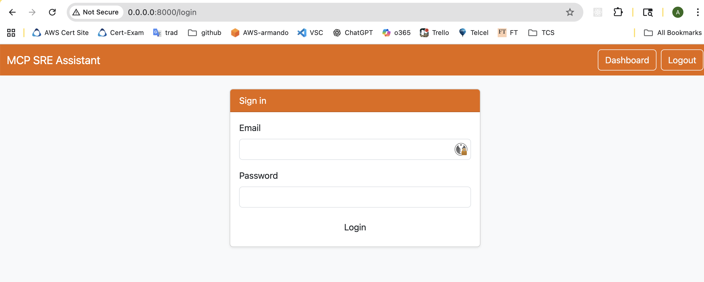
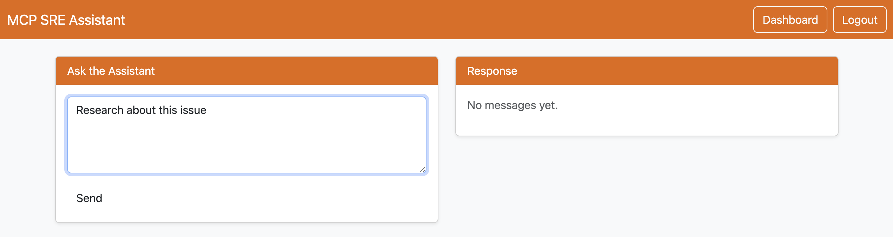
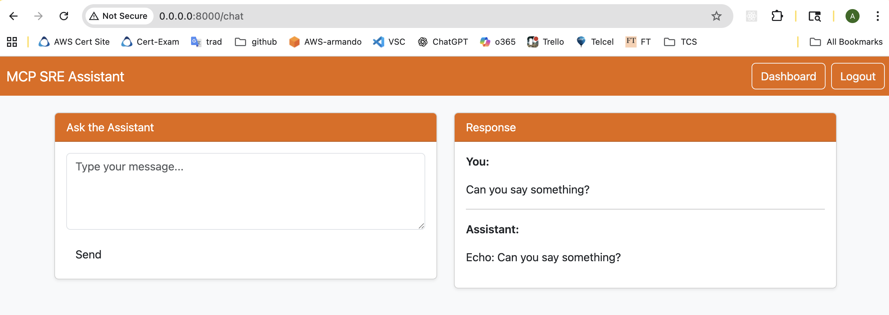

# mcp-frontend

MCP front end App

<details close>
<summary>mcp-frontend copilot prompt</summary>

Prompt
I need to create a web application in Python that will serve as the front-end for an AI application. Interaction with the AI ​​application will be via a REST API, to which requests will be sent via POST in the `message` parameter. The application must be responsive and visually appealing, using an orange color scheme. It should have role-based authentication and authorization (admin, user, viewer), initially based on a table in Google Cloud Platform (GCP) BigQuery. The application must be ready for deployment on GCP using a virtual machine and a Terraform script. The Terraform script will also create the necessary resources, such as a service account named `mcp-sre-assistant-sa`. A set of test cases is required. Initially, a mock of the AI ​​application's REST API will also be needed to allow development to proceed while the actual REST API is being created. Class names, variable names, and code documentation must be in English.

Copilot prompt: https://copilot.microsoft.com/chats/i8scNkMN7iyAGUAEeJmE2

</details>

<details close>
<summary>mcp-frontend app dir structure</summary>

```text
mcp-sre-assistant/
.
├── README.md
├── app
│   ├── __init__.py
│   ├── __pycache__
│   ├── ai_client.py
│   ├── auth.py
│   ├── bigquery_client.py
│   ├── main.py
│   ├── rbac.py
│   ├── settings.py
│   ├── static
│   └── templates
├── mcp_frontend.egg-info
│   ├── PKG-INFO
│   ├── SOURCES.txt
│   ├── dependency_links.txt
│   ├── requires.txt
│   └── top_level.txt
├── mock_ai
│   ├── __pycache__
│   └── server.py
├── pyproject.toml
├── requirements.txt
├── sql
│   └── users.sql
├── terraform
│   ├── README.md
│   ├── main.tf
│   ├── outputs.tf
│   ├── startup.sh
│   ├── startup.sh.bkp
│   ├── terraform.tfstate
│   ├── terraform.tfstate.backup
│   └── variables.tf
├── tests
│   ├── __pycache__
│   ├── test_ai_integration.py
│   ├── test_auth.py
│   └── test_rbac.py
└── venv3.11
    ├── bin
    ├── etc
    ├── include
    ├── lib
    ├── pyvenv.cfg
    └── share
```

</details>

## Run

<details close>
<summary>Run App</summary>

```shell
# python 3.11
/Library/Frameworks/Python.framework/Versions/3.11/bin/python3.11 -m venv venv3.11
source venv3.11/bin/activate

# Create venv
which pip
./venv3.11/bin/python3 -m pip install uvicorn fastapi jinja2 google-cloud-bigquery httpx python-dotenv starlette itsdangerous pydantic_settings python-multipart
./venv3.11/bin/python3 -m pip install "passlib[argon2]"
# Create app as a package
# Add packages = ["app"] in pyproject.toml
pip install -e .

# Run
which python
./venv3.11/bin/python3 -m uvicorn app.main:app --host 0.0.0.0 --port 8000
```

</details>

<details close>
<summary>Run tests</summary>

```shell
# python 3.11
/Library/Frameworks/Python.framework/Versions/3.11/bin/python3.11 -m venv venv3.11
source venv3.11/bin/activate

# Create venv
which python
pip install ipympl ipython jupyterlab matplotlib nodejs numpy seaborn starlette fastapi pytest itsdangerous pydantic_settings passlib google-cloud-bigquery python-multipart
#uvicorn jinja2 passlib[argon2] httpx python-dotenv 
# Create app as a package
which pip
# Add packages = ["app"] in pyproject.toml
pip install -e .

# Run
which pytest
pytest -q
```

</details>

## User guide

App usage is really simple, just login to the app, and request something to the AI. AI will respond

Steps,
- Start app (if required): ```run-app.sh```
- Start mock server (if required): ```run-mock.sh```
- Login using URL http://0.0.0.0:8000/login
  - Users: jarmando_ml@hotmail.com, armando.martinez.esausi@gmail.com
- Request
- Result

<details close>
<summary>Screen capture examples</summary>

**Login**


**Request**


**Result**


</details>

<details close>
<summary>Terminal logs when normal behavior</summary>

```console
[notice] To update, run: pip install --upgrade pip
INFO:     Started server process [39937]
INFO:     Waiting for application startup.
INFO:     Application startup complete.
INFO:     Uvicorn running on http://0.0.0.0:8000 (Press CTRL+C to quit)
INFO:     127.0.0.1:53713 - "POST /login HTTP/1.1" 303 See Other
INFO:     127.0.0.1:53713 - "GET /dashboard HTTP/1.1" 200 OK
INFO:     127.0.0.1:54047 - "POST /chat HTTP/1.1" 200 OK
INFO:     127.0.0.1:54065 - "GET /dashboard HTTP/1.1" 200 OK
INFO:     127.0.0.1:54099 - "POST /chat HTTP/1.1" 200 OK
INFO:     127.0.0.1:54271 - "GET /logout HTTP/1.1" 303 See Other
INFO:     127.0.0.1:54271 - "GET /login HTTP/1.1" 200 OK
INFO:     127.0.0.1:54291 - "POST /login HTTP/1.1" 401 Unauthorized
INFO:     127.0.0.1:54327 - "POST /login HTTP/1.1" 303 See Other
INFO:     127.0.0.1:54327 - "GET /dashboard HTTP/1.1" 200 OK
```

</details>

<details close>
<summary>ERROR: Mock server is down</summary>

```console
INFO:     127.0.0.1:53757 - "POST /chat HTTP/1.1" 500 Internal Server Error
ERROR:    Exception in ASGI application
Traceback (most recent call last):
  File "/Users/armando/prg/git-hub/ai/mcp-frontend/venv3.11/lib/python3.11/site-packages/httpx/_transports/default.py", line 101, in map_httpcore_exceptions
    yield
  File "/Users/armando/prg/git-hub/ai/mcp-frontend/venv3.11/lib/python3.11/site-packages/httpx/_transports/default.py", line 394, in handle_async_request
    resp = await self._pool.handle_async_request(req)
           ^^^^^^^^^^^^^^^^^^^^^^^^^^^^^^^^^^^^^^^^^^
  File "/Users/armando/prg/git-hub/ai/mcp-frontend/venv3.11/lib/python3.11/site-packages/httpcore/_async/connection_pool.py", line 256, in handle_async_request
    raise exc from None
  File "/Users/armando/prg/git-hub/ai/mcp-frontend/venv3.11/lib/python3.11/site-packages/httpcore/_async/connection_pool.py", line 236, in handle_async_request
    response = await connection.handle_async_request(
               ^^^^^^^^^^^^^^^^^^^^^^^^^^^^^^^^^^^^^^
  File "/Users/armando/prg/git-hub/ai/mcp-frontend/venv3.11/lib/python3.11/site-packages/httpcore/_async/connection.py", line 101, in handle_async_request
    raise exc
  File "/Users/armando/prg/git-hub/ai/mcp-frontend/venv3.11/lib/python3.11/site-packages/httpcore/_async/connection.py", line 78, in handle_async_request
    stream = await self._connect(request)
             ^^^^^^^^^^^^^^^^^^^^^^^^^^^^
  File "/Users/armando/prg/git-hub/ai/mcp-frontend/venv3.11/lib/python3.11/site-packages/httpcore/_async/connection.py", line 124, in _connect
    stream = await self._network_backend.connect_tcp(**kwargs)
             ^^^^^^^^^^^^^^^^^^^^^^^^^^^^^^^^^^^^^^^^^^^^^^^^^
  File "/Users/armando/prg/git-hub/ai/mcp-frontend/venv3.11/lib/python3.11/site-packages/httpcore/_backends/auto.py", line 31, in connect_tcp
    return await self._backend.connect_tcp(
           ^^^^^^^^^^^^^^^^^^^^^^^^^^^^^^^^
  File "/Users/armando/prg/git-hub/ai/mcp-frontend/venv3.11/lib/python3.11/site-packages/httpcore/_backends/anyio.py", line 113, in connect_tcp
    with map_exceptions(exc_map):
  File "/Library/Frameworks/Python.framework/Versions/3.11/lib/python3.11/contextlib.py", line 155, in __exit__
    self.gen.throw(typ, value, traceback)
  File "/Users/armando/prg/git-hub/ai/mcp-frontend/venv3.11/lib/python3.11/site-packages/httpcore/_exceptions.py", line 14, in map_exceptions
    raise to_exc(exc) from exc
httpcore.ConnectError: All connection attempts failed

The above exception was the direct cause of the following exception:

Traceback (most recent call last):
  File "/Users/armando/prg/git-hub/ai/mcp-frontend/venv3.11/lib/python3.11/site-packages/uvicorn/protocols/http/h11_impl.py", line 403, in run_asgi
    result = await app(  # type: ignore[func-returns-value]
             ^^^^^^^^^^^^^^^^^^^^^^^^^^^^^^^^^^^^^^^^^^^^^^
  File "/Users/armando/prg/git-hub/ai/mcp-frontend/venv3.11/lib/python3.11/site-packages/uvicorn/middleware/proxy_headers.py", line 60, in __call__
    return await self.app(scope, receive, send)
           ^^^^^^^^^^^^^^^^^^^^^^^^^^^^^^^^^^^^
  File "/Users/armando/prg/git-hub/ai/mcp-frontend/venv3.11/lib/python3.11/site-packages/fastapi/applications.py", line 1135, in __call__
    await super().__call__(scope, receive, send)
  File "/Users/armando/prg/git-hub/ai/mcp-frontend/venv3.11/lib/python3.11/site-packages/starlette/applications.py", line 107, in __call__
    await self.middleware_stack(scope, receive, send)
  File "/Users/armando/prg/git-hub/ai/mcp-frontend/venv3.11/lib/python3.11/site-packages/starlette/middleware/errors.py", line 186, in __call__
    raise exc
  File "/Users/armando/prg/git-hub/ai/mcp-frontend/venv3.11/lib/python3.11/site-packages/starlette/middleware/errors.py", line 164, in __call__
    await self.app(scope, receive, _send)
  File "/Users/armando/prg/git-hub/ai/mcp-frontend/venv3.11/lib/python3.11/site-packages/starlette/middleware/sessions.py", line 85, in __call__
    await self.app(scope, receive, send_wrapper)
  File "/Users/armando/prg/git-hub/ai/mcp-frontend/venv3.11/lib/python3.11/site-packages/starlette/middleware/exceptions.py", line 63, in __call__
    await wrap_app_handling_exceptions(self.app, conn)(scope, receive, send)
  File "/Users/armando/prg/git-hub/ai/mcp-frontend/venv3.11/lib/python3.11/site-packages/starlette/_exception_handler.py", line 53, in wrapped_app
    raise exc
  File "/Users/armando/prg/git-hub/ai/mcp-frontend/venv3.11/lib/python3.11/site-packages/starlette/_exception_handler.py", line 42, in wrapped_app
    await app(scope, receive, sender)
  File "/Users/armando/prg/git-hub/ai/mcp-frontend/venv3.11/lib/python3.11/site-packages/fastapi/middleware/asyncexitstack.py", line 18, in __call__
    await self.app(scope, receive, send)
  File "/Users/armando/prg/git-hub/ai/mcp-frontend/venv3.11/lib/python3.11/site-packages/starlette/routing.py", line 716, in __call__
    await self.middleware_stack(scope, receive, send)
  File "/Users/armando/prg/git-hub/ai/mcp-frontend/venv3.11/lib/python3.11/site-packages/starlette/routing.py", line 736, in app
    await route.handle(scope, receive, send)
  File "/Users/armando/prg/git-hub/ai/mcp-frontend/venv3.11/lib/python3.11/site-packages/starlette/routing.py", line 290, in handle
    await self.app(scope, receive, send)
  File "/Users/armando/prg/git-hub/ai/mcp-frontend/venv3.11/lib/python3.11/site-packages/fastapi/routing.py", line 117, in app
    await wrap_app_handling_exceptions(app, request)(scope, receive, send)
  File "/Users/armando/prg/git-hub/ai/mcp-frontend/venv3.11/lib/python3.11/site-packages/starlette/_exception_handler.py", line 53, in wrapped_app
    raise exc
  File "/Users/armando/prg/git-hub/ai/mcp-frontend/venv3.11/lib/python3.11/site-packages/starlette/_exception_handler.py", line 42, in wrapped_app
    await app(scope, receive, sender)
  File "/Users/armando/prg/git-hub/ai/mcp-frontend/venv3.11/lib/python3.11/site-packages/fastapi/routing.py", line 103, in app
    response = await f(request)
               ^^^^^^^^^^^^^^^^
  File "/Users/armando/prg/git-hub/ai/mcp-frontend/venv3.11/lib/python3.11/site-packages/fastapi/routing.py", line 424, in app
    raw_response = await run_endpoint_function(
                   ^^^^^^^^^^^^^^^^^^^^^^^^^^^^
  File "/Users/armando/prg/git-hub/ai/mcp-frontend/venv3.11/lib/python3.11/site-packages/fastapi/routing.py", line 310, in run_endpoint_function
    return await dependant.call(**values)
           ^^^^^^^^^^^^^^^^^^^^^^^^^^^^^^
  File "/Users/armando/prg/git-hub/ai/mcp-frontend/app/main.py", line 32, in chat
    ai_resp = await send_message_to_ai(message)
              ^^^^^^^^^^^^^^^^^^^^^^^^^^^^^^^^^
  File "/Users/armando/prg/git-hub/ai/mcp-frontend/app/ai_client.py", line 7, in send_message_to_ai
    r = await client.post(settings.ai_api_url, json={"message": message})
        ^^^^^^^^^^^^^^^^^^^^^^^^^^^^^^^^^^^^^^^^^^^^^^^^^^^^^^^^^^^^^^^^^
  File "/Users/armando/prg/git-hub/ai/mcp-frontend/venv3.11/lib/python3.11/site-packages/httpx/_client.py", line 1859, in post
    return await self.request(
           ^^^^^^^^^^^^^^^^^^^
  File "/Users/armando/prg/git-hub/ai/mcp-frontend/venv3.11/lib/python3.11/site-packages/httpx/_client.py", line 1540, in request
    return await self.send(request, auth=auth, follow_redirects=follow_redirects)
           ^^^^^^^^^^^^^^^^^^^^^^^^^^^^^^^^^^^^^^^^^^^^^^^^^^^^^^^^^^^^^^^^^^^^^^
  File "/Users/armando/prg/git-hub/ai/mcp-frontend/venv3.11/lib/python3.11/site-packages/httpx/_client.py", line 1629, in send
    response = await self._send_handling_auth(
               ^^^^^^^^^^^^^^^^^^^^^^^^^^^^^^^
  File "/Users/armando/prg/git-hub/ai/mcp-frontend/venv3.11/lib/python3.11/site-packages/httpx/_client.py", line 1657, in _send_handling_auth
    response = await self._send_handling_redirects(
               ^^^^^^^^^^^^^^^^^^^^^^^^^^^^^^^^^^^^
  File "/Users/armando/prg/git-hub/ai/mcp-frontend/venv3.11/lib/python3.11/site-packages/httpx/_client.py", line 1694, in _send_handling_redirects
    response = await self._send_single_request(request)
               ^^^^^^^^^^^^^^^^^^^^^^^^^^^^^^^^^^^^^^^^
  File "/Users/armando/prg/git-hub/ai/mcp-frontend/venv3.11/lib/python3.11/site-packages/httpx/_client.py", line 1730, in _send_single_request
    response = await transport.handle_async_request(request)
               ^^^^^^^^^^^^^^^^^^^^^^^^^^^^^^^^^^^^^^^^^^^^^
  File "/Users/armando/prg/git-hub/ai/mcp-frontend/venv3.11/lib/python3.11/site-packages/httpx/_transports/default.py", line 393, in handle_async_request
    with map_httpcore_exceptions():
  File "/Library/Frameworks/Python.framework/Versions/3.11/lib/python3.11/contextlib.py", line 155, in __exit__
    self.gen.throw(typ, value, traceback)
  File "/Users/armando/prg/git-hub/ai/mcp-frontend/venv3.11/lib/python3.11/site-packages/httpx/_transports/default.py", line 118, in map_httpcore_exceptions
    raise mapped_exc(message) from exc
httpx.ConnectError: All connection attempts failed
```

How to fix it:
- Start the mock server using shell script "run-mock.sh"
</details>